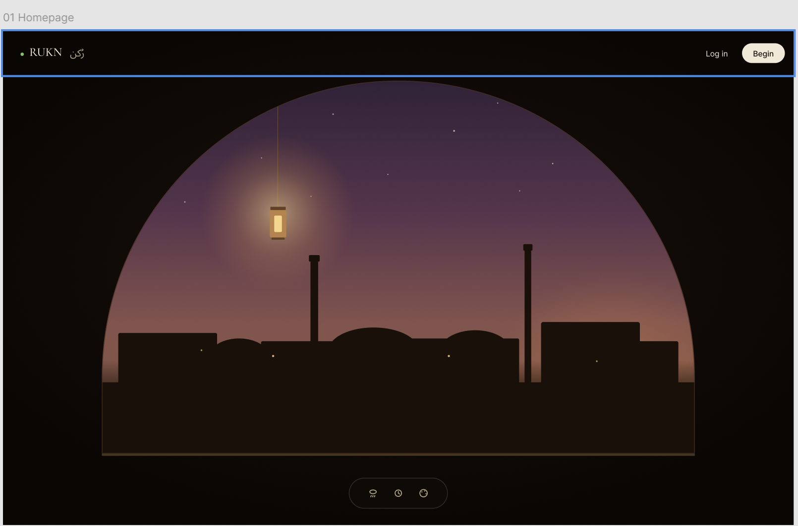
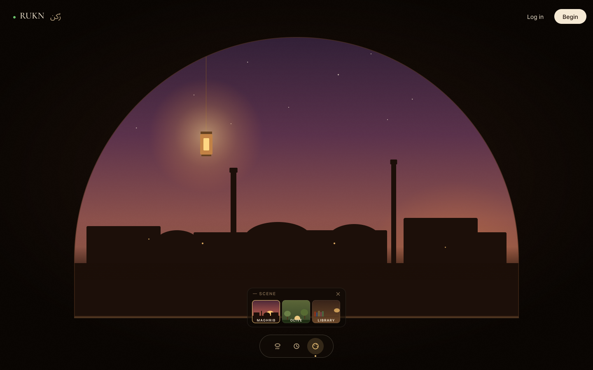
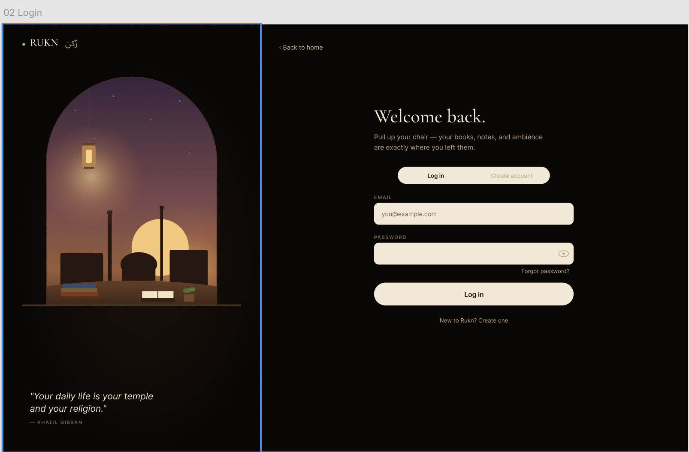
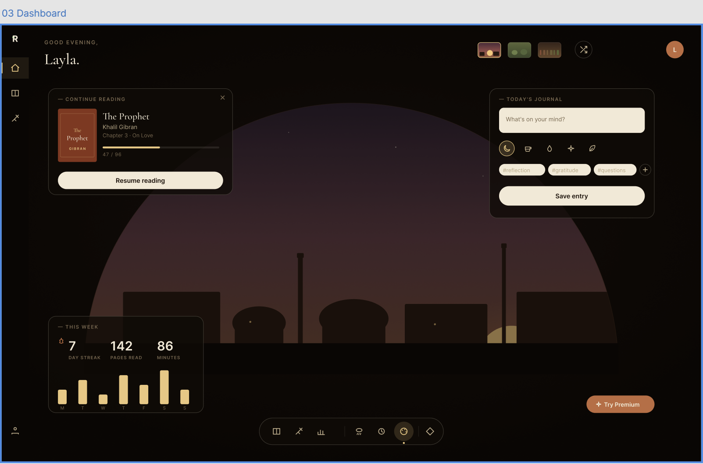
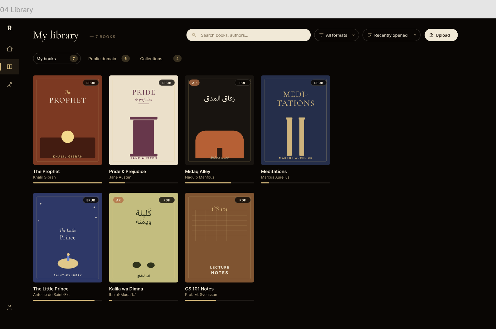
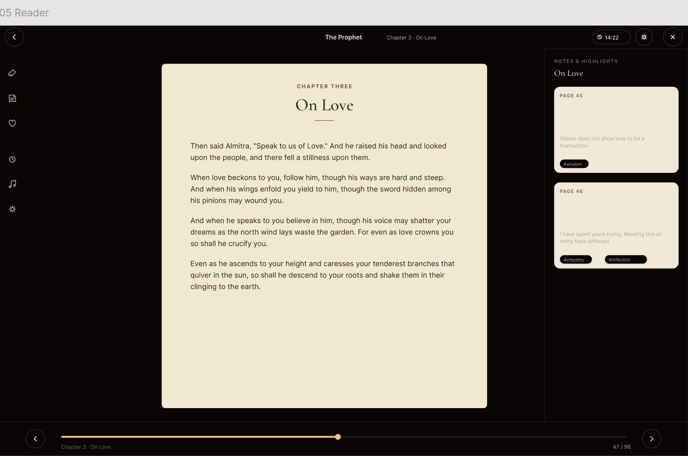
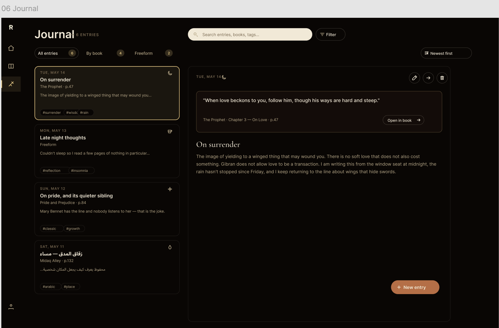
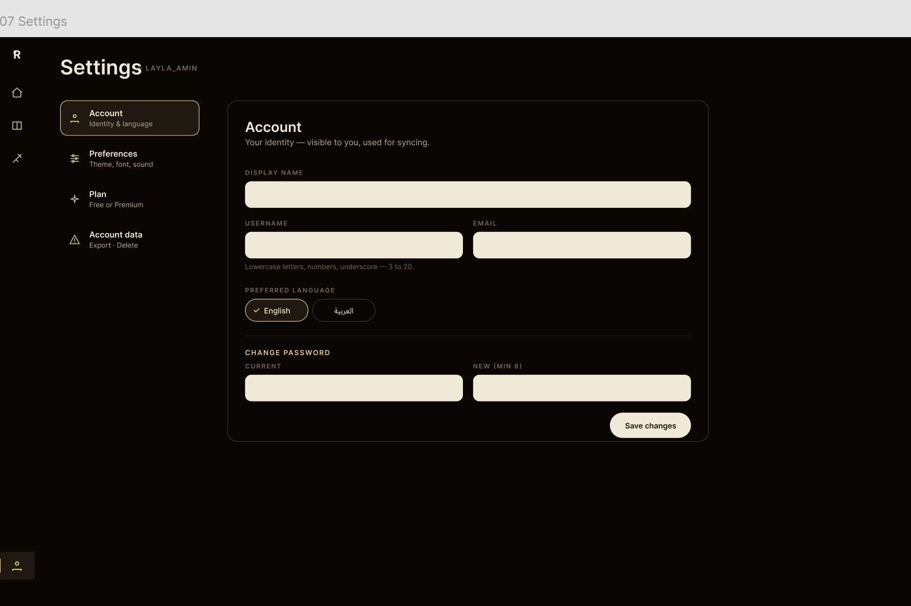
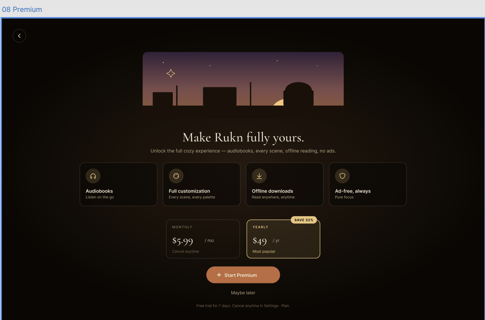

\newpage

# 0. Submission package

| Item | Where |
|---|---|
| **Figma file (edit)** | <https://www.figma.com/design/p2AijWf8LQuh9paEm12eaW> |
| **Figma prototype (play)** | <https://www.figma.com/proto/p2AijWf8LQuh9paEm12eaW/?node-id=20-2&starting-point-node-id=20%3A2> |
| **Source code** (this folder) | `Group02_RUKN_Assignment3.zip` |
| **Implementation starter** (HTML/CSS/JS) | `src/dashboard.html` |
| **Schema** | `database/schema.sql` (unchanged from A2) |
| **Original A2 doc** | `docs/RUKN_Assignment_2.md` |
| **This document (markdown)** | `Group02_RUKN_Assignment3.md` |

**Team — Group 02**

| Name | ID |
|---|---|
| Zomorodah Bakhit | 122200145 |
| Omar Othman | 122200162 |
| Rewan Afifi | 122200013 |
| Reem Khalil | 122200137 |
| Faysal Dabbagh | 122200015 |
| Omar Anouti | 121200031 |

\newpage

# 1. Project overview

**Rukn** (رُكن — Arabic for *a corner*) is a bilingual (Arabic / English) web application that gathers three reading experiences into one cozy space:

1. A full in-app e-book reader for **PDF** and **EPUB** files.
2. A passage-linked **journaling system** — select text, attach a reflection right to that passage, or write freeform thoughts in a global journal.
3. A customizable **ambient corner** with three illustrated scenes (Maghrib dusk, Olive grove, Cozy library), five ambient sounds, and a focus timer.

Three conceptual user roles:

- **Guest** — unregistered visitor, time-limited sampling, no persistence.
- **Free registered user** — full reading, full journaling, full library tools, three sounds, one scene.
- **Paid registered user** — every scene, every sound, audiobooks, offline downloads, ad-free.

The visual language is warm, dim, and grounded: deep dusk-brown canvas, hand-set dome-and-minaret silhouettes set against a gradient sky, hanging amber lantern, custom-drawn line icons (no emojis), Cormorant Garamond display + Manrope body + Amiri/Noto Kufi Arabic for RTL content. Every screen ships with glass cards, sub-pixel typography, and a centered-from-button press animation.

\newpage

# 2. Final screen set

The shipped prototype contains **8 main screens, 6 homepage variants, 4 settings variants, and 4 modal overlays** — all native Figma layers (no image-fill placeholders) with real prototype reactions wired between them.

| # | Screen | Frame ID | Notes |
|---|---|---|---|
| 01 | Homepage (Maghrib) | `20:2` | Base scene + 3 dock variants (sounds, timer, scenes open) + 2 alt scenes (Olive `53:2`, Library `53:72`). |
| 02 | Login / Register | `21:2` | Split layout, brand vignette with arch + lantern + Gibran pull-quote, form card with tabs. |
| 03 | Dashboard | `21:39` | Glass widget canvas over dusk scene; Continue Reading + Today's Journal + Stats + Dock + Try Premium. |
| 04 | Library | `22:2` | 7 unique illustrated book covers; working Filter + Sort dropdown overlays; tabs (My books / Public domain / Collections). |
| 05 | Reader | `22:114` | Sepia paper, left tool rail, right notes panel, footer with progress bar. |
| 06 | Journal | `22:177` | List + detail two-pane; filter pill, sort pill, FAB. Mixed LTR + RTL entries. |
| 07 | Settings | `22:277` | Section nav + active card. **Sub-variants:** Preferences `69:?`, Plan `?`, Account data `?` — each section pill swaps the entire card content. |
| 08 | Premium | `68:2` | Full-page hero + 4 feature cards + Monthly/Yearly plan toggle + Start Premium CTA. |

**Modal overlays:**

| Modal | Trigger | Frame |
|---|---|---|
| Sounds window | Dock 🌧 button | sibling frame, dock icon highlights |
| Timer window | Dock ⏱ button | sibling frame, dock icon highlights |
| Scene window | Dock 🎨 button | sibling frame; 3 thumbs swap homepage scene |
| Library Filter dropdown | Filter pill | OPEN_OVERLAY, X closes |
| Library Sort dropdown | Sort pill | OPEN_OVERLAY, X closes |
| Delete-account confirm | Settings → Account data → Delete | modal hosted on dim backdrop |

\newpage

# 3. Screen reference (renders from the new Figma file)

## 3.1 Homepage

{width=100%}

The arch silhouette reveals a setting sun, a row of domed mosques, two minarets, and a single lit window — all grounded on a continuous dark foreground strip (no floating squares). A brass lantern hangs from the top of the arch with a warm radial glow. The bottom-center dock has three round buttons (Rain → Sound window, Clock → Timer window, Palette → Scene window). Top-right has a ghost **Log in** button and a paper **Begin** primary button — both routed to Login.

## 3.2 Homepage — Scene window open

{width=100%}

Clicking the palette dock button navigates to a sibling frame where (a) the palette button gains an amber active highlight and a dot underneath, and (b) the Scene window appears above the dock. Each thumbnail is a real mini illustration (sun + city silhouette / olive trees / books on a shelf), not a swatch. Clicking Olive or Library navigates to one of the alternate base homepages (`53:2` or `53:72`). The × closes the window back to the base.

## 3.3 Login / Register

{width=100%}

Split-screen: left panel has the brand mark, a smaller arch with its own lantern and city, a windowsill with stacked books + an open book + a small plant, and the Khalil Gibran pull-quote in EB Garamond Italic (deliberately clean, not curly). Right panel hosts the form card — *Welcome back*, segmented Log in / Create account tabs, email + password fields with eye toggle, forgot link, primary submit. Back-arrow top-left returns to Homepage.

## 3.4 Dashboard

{width=100%}

Top bar: greeting eyebrow + *Layla.* in serif. Right cluster: 3 scene quick-switch thumbs, shuffle icon, avatar circle. Three glass cards float over a dimmed dusk arch backdrop: **Continue Reading** with mini book cover + progress, **Today's Journal** with text area + 5 vector mood icons + tag chips + Save, and **Reading Stats** with three big numbers + a 7-day bar chart. Dock at the bottom with seven dock buttons (Continue, Journal, Stats, Sounds, Timer, Scene, Customize). **Try Premium** warm pill bottom-right routes to Screen 08.

## 3.5 Library

{width=100%}

Title baseline reads "**My library** — 7 BOOKS" (inline count badge). Right of the search input are real **Filter** and **Sort** pill buttons that open dropdown overlays. Seven unique book covers, each hand-illustrated:

- *The Prophet* — warm brown, mountain + sun + serif title
- *Pride & Prejudice* — cream with classical column
- *زقاق المدق* (Midaq Alley) — dark with orange arch silhouette + Arabic typography
- *Meditations* — deep blue with two golden columns
- *The Little Prince* — blue with a tiny prince on a planet under stars
- *كليلة ودمنة* (Kalila wa Dimna) — olive with two animal silhouettes
- *CS 101 Notes* — warm brown with a grid pattern overlay

Format badges (EPUB / PDF), AR badges where applicable, and progress bars below each cover.

## 3.6 Reader

{width=100%}

Sepia paper card centered, chapter eyebrow + serif title + thin rule + four paragraphs of *On Love* — Khalil Gibran (real text, not lorem ipsum). Top mini-bar has back arrow, centered book title + chapter, session timer pill, cog icon, close ×. Left vertical tool rail: highlight, note, bookmark, then a divider, then focus timer, ambient audio, settings. Right notes panel with two example highlight cards (page numbers, excerpts, titles, bodies, hash-tag chips). Footer has prev/next page buttons and a continuous progress bar at 47/96.

## 3.7 Journal

{width=100%}

Two-pane: entries list (left) with four cards showing date + vector mood icon + title + book reference + excerpt + tag chips. Right pane is the selected entry's detail with edit/share/delete icon row, a warm quote block with **Open in book** link back to the Reader, a serif title, and the entry body. One entry is rendered in Arabic (Mahfouz, *Midaq Alley*) to demonstrate inline RTL support. **+ New entry** warm pill bottom-right opens the composer.

## 3.8 Settings — Account

{width=100%}

Section nav left: **Account** (active, amber outline + check icon), Preferences, Plan, Account data. Right card: display name, username, email, preferred language pill group (English check-marked active), change-password dual field, Save changes primary button. The other three section pills are wired — clicking navigates to a sibling frame whose right card swaps to Preferences, Plan, or Account data content (real cards, not placeholders).

## 3.9 Premium (08 — new)

{width=100%}

Hero card with stylized dusk scene + sparkle. Big serif headline *Make Rukn fully yours.* Four feature cards in a row: **Audiobooks**, **Full customization**, **Offline downloads**, **Ad-free, always** — each with a vector icon in an amber circle. Plan toggle: **Monthly** ($5.99) vs **Yearly** ($49) — the yearly card is highlighted with a "Save 32%" floating badge. **Start Premium** warm CTA + **Maybe later** ghost link. Back-arrow top-left returns to Dashboard.

\newpage

# 4. Updated UI – CRUD mapping

> Supersedes Section E of Assignment 2. Every action in the final shipped prototype is listed below with its database target and CRUD verb. Table names match the schema in `database/schema.sql` (unchanged from A2).

## 4.1 Screen 01 — Homepage

| User action | Table(s) | CRUD |
|---|---|---|
| Land on page | — | None (guest, client-side only) |
| Click Log in | — | Navigate → Screen 02 |
| Click Begin | — | Navigate → Screen 02 |
| Click dock Sound / Timer / Scene | — | None (UI sibling-frame swap; preview only) |
| Pick Maghrib / Olive / Library in Scene window | — | None for guests; would set `user_preferences.background` for registered users |

## 4.2 Screen 02 — Login / Register

| User action | Table(s) | CRUD |
|---|---|---|
| Submit login form | `users` (READ), `users.last_login` (UPDATE) | READ + UPDATE |
| Submit register form | `users`, `free_users`, `user_preferences`, `journals` (freeform) | CREATE (atomic — 4 inserts) |
| Inline email-format validation | — | None (client-only) |
| Inline password-strength validation | — | None (client-only) |
| Back to home | — | Navigate → Screen 01 |

## 4.3 Screen 03 — Dashboard

| User action | Table(s) | CRUD |
|---|---|---|
| Load "Continue Reading" | `reading_progress` ⨝ `books` | READ |
| Click Resume | `reading_progress.last_read_at` | UPDATE + navigate |
| Save quick journal from widget | `journal_entries`, `tags`, `journal_entry_tags` | CREATE |
| Load Reading Stats | `reading_progress` (aggregated) | READ |
| Toggle a sound chip | `user_preferences.ambient_sound` | UPDATE |
| Drag volume slider | `user_preferences.sound_volume` | UPDATE (debounced) |
| Click avatar | — | Navigate → Settings |
| Click Try Premium pill | — | Navigate → Screen 08 |
| Click locked Customization / Audiobook widget | — | Navigate → Screen 08 |
| Sidebar Library / Journal / Settings | — | Navigate |
| Focus timer start / pause / reset / skip | — | UI state only (future: `reading_progress.total_seconds_read`) |

## 4.4 Screen 04 — Library

| User action | Table(s) | CRUD |
|---|---|---|
| Load My Books tab | `books` WHERE `uploaded_by = user`, ⨝ `reading_progress` | READ |
| Load Public Domain tab | `books` WHERE `is_public_domain = TRUE` | READ |
| Load Collections tab | `collections`, `collection_books`, `books` | READ |
| Search input | `books` (LIKE on title / author) | READ |
| Filter pill → dropdown → pick a format | `books` filtered | READ |
| Sort pill → dropdown → pick an option | `books` re-ordered | READ |
| Click book cover | `reading_progress` (created if missing) | READ + CREATE-on-first-open |
| Upload button → modal → submit | `books` | CREATE |
| Long-press book → Remove | `books` (cascades) | DELETE |
| Add to collection (from book menu) | `collection_books` | CREATE |
| Create collection (Collections tab) | `collections` | CREATE |
| Rename collection | `collections.name` | UPDATE |
| Remove book from collection | `collection_books` | DELETE |

## 4.5 Screen 05 — Reader

| User action | Table(s) | CRUD |
|---|---|---|
| Open a book | `reading_progress` ⨝ `books` + load file | READ |
| Auto-save progress every 30 s | `reading_progress` (current_page, pages_read, total_seconds_read, last_read_at) | UPDATE |
| Click prev / next page | same | UPDATE |
| Highlight a passage (color only) | `highlights` | CREATE |
| Change highlight color | `highlights.color` | UPDATE |
| Delete a highlight | `highlights` (linked entries survive with `highlight_id = NULL`) | DELETE |
| Highlight + Add note overlay → Save | `highlights` (insert), `journals` (book — INSERT IGNORE), `journal_entries`, `tags`, `journal_entry_tags` | CREATE (1–4 inserts) |
| Bookmark icon | `bookmarks` | CREATE / DELETE (toggle) |
| Open right notes panel | `highlights`, `journal_entries` for current chapter | READ |
| Adjust display settings (font / theme) | `user_preferences` (or future per-book overrides) | UPDATE |
| Back to library | — | Navigate |
| Close × | — | Navigate → Dashboard |

## 4.6 Screen 06 — Journal

| User action | Table(s) | CRUD |
|---|---|---|
| Load All entries / By book / Freeform tab | `journal_entries` ⨝ `journals` ⟕ `highlights`, `books` | READ |
| Search entries | LIKE on `journal_entries.content / title`, `tags.name` | READ |
| Sort newest / oldest | same, `ORDER BY entry_date` | READ |
| Filter pill → pick a tag | `journal_entry_tags` ⨝ `tags` | READ |
| Click entry card | reads the row + its tags | READ |
| Open in book | — | Navigate → Reader at `highlights.page_number` |
| + New entry FAB → composer → Save | `journals` (freeform), `journal_entries`, `tags`, `journal_entry_tags` | CREATE |
| Edit (pen icon) → inline → Save | `journal_entries.title / content / updated_at` | UPDATE |
| Add a tag inside an entry | `tags` (INSERT IGNORE), `journal_entry_tags` | CREATE |
| Remove a tag chip | `journal_entry_tags` | DELETE |
| Delete (trash icon) → confirm | `journal_entries` (cascades to `journal_entry_tags`; `highlights` survive) | DELETE |

## 4.7 Screen 07 — Settings (4 sections)

| User action | Table(s) | CRUD |
|---|---|---|
| Open Settings (any section) | `users`, `user_preferences` | READ |
| **Account →** Update display name / username / email | `users` | UPDATE |
| Account → Pick preferred language pill | `users.preferred_lang` | UPDATE |
| Account → Change password (current + new) | `users.password_hash` (after verify) | UPDATE |
| Account → Save changes button | commits the dirty fields above | UPDATE |
| **Preferences →** Pick a theme card | `user_preferences.theme` | UPDATE |
| Preferences → Pick a reading font | `user_preferences.font` | UPDATE |
| Preferences → Font-size slider | `user_preferences.font_size` | UPDATE |
| Preferences → Default ambient sound pill | `user_preferences.ambient_sound` | UPDATE |
| Preferences → Default volume slider | `user_preferences.sound_volume` | UPDATE |
| **Plan (free) →** Start Premium | `paid_users` (INSERT), `free_users` (DELETE) | CREATE + DELETE (transactional) |
| Plan (paid) → Cancel subscription | `paid_users` (DELETE), `free_users` (INSERT) | DELETE + CREATE |
| **Account data →** Download .json | All user-owned tables | READ-only (assembled client-side, downloaded as a blob) |
| Account data → Delete account → confirm-phrase → Yes | `users` | DELETE (cascades through every owned table) |

## 4.8 Screen 08 — Premium upgrade

| User action | Table(s) | CRUD |
|---|---|---|
| Toggle Monthly / Yearly | — | None (UI state) |
| Click Start Premium | `paid_users` (INSERT), `free_users` (DELETE) | CREATE + DELETE |
| Click Maybe later / back-arrow | — | Navigate → Dashboard |

## 4.9 Cascade summary

`DELETE FROM users WHERE user_id = ?` removes the row and, via `ON DELETE CASCADE`, also removes:

- `free_users` *or* `paid_users` row
- `user_preferences`
- `reading_progress`
- `highlights` (and their `journal_entry.highlight_id` references go NULL — entries survive)
- `bookmarks`
- `journals` (and their `journal_entries`, which cascade their `journal_entry_tags`)
- `tags`
- `collections` (and their `collection_books`)

Books that the user uploaded survive with `uploaded_by = NULL` (ON DELETE SET NULL).

\newpage

# 5. Validation logic

Every form in the prototype layers three validation passes: **HTML5 attributes** (cheap, in-browser, kicks in before JS loads), **JavaScript rules** (richer messaging, debounced live-checks), and (in a real backend) server-side re-validation. The table below covers every input the user can touch.

## 5.1 Field-by-field rules

| Screen | Field | HTML5 attrs | JS rule | UI on failure |
|---|---|---|---|---|
| **Register** | Username | `required pattern="[a-z0-9_]{3,20}"` | Lowercase letters / numbers / underscore, 3–20 chars | Red border, inline ⚠ `Use lowercase letters, numbers, underscore — 3 to 20.` |
| Register | Email | `required type="email"` | RFC pattern + DNS-style TLD | ⚠ `Please enter a valid email address.` |
| Register | Password | `required minlength="8"` | ≥ 8 chars AND contains a digit or symbol | ⚠ `At least 8 characters with one number or symbol.` |
| Register | Confirm password | `required` | Must equal Password field | ⚠ `Passwords don't match.` |
| **Login** | Email | `required type="email"` | Same as register | Same |
| Login | Password | `required` | Non-empty | ⚠ `Password is required.` |
| Login | Submit | — | Both fields pass before POST allowed | Submit visually disabled (opacity 0.4, `cursor:not-allowed`) |
| **Dashboard journal widget** | Body | `required minlength="3" maxlength="500"` | 3–500 trimmed chars; live char counter | ⚠ `Please write something before saving.` / ⚠ `Entry is too long (max 500).` |
| Dashboard journal | Tag input | `pattern="[a-z0-9\-]+" maxlength="20"` | Lowercase letters / numbers / dash, max 5 tags / entry | Red-mark toast: `Lowercase, letters/numbers/dash only.` |
| **Reader → Add Note overlay** | Body | `required minlength="3"` | Same as dashboard | Same |
| Reader add note | Tags | Same | Same | Same |
| **Journal → New Entry overlay** | Title | `maxlength="80"` | Optional; defaults to "Untitled" | — |
| Journal new entry | Body | `required minlength="3"` | Same | Same |
| Journal new entry | Tags | Same | Same | Same |
| **Library → Upload Book modal** | File picker | `required accept=".pdf,.epub"` | MIME-type sniff + ≤ 50 MB | ⚠ `Only PDF or EPUB, up to 50 MB.` |
| Upload book | Title | `required maxlength="255"` | Non-empty | ⚠ `Title is required.` |
| Upload book | Author | `maxlength="255"` | Optional | — |
| **Settings → Account** | Display name | `maxlength="40"` | Non-empty when changed | ⚠ `Display name can't be empty.` |
| Settings account | Username | `pattern="[a-z0-9_]{3,20}"` | Same as register | Same |
| Settings account | Email | `type="email"` | Same as register | Same |
| Settings account | Current password | `required when New is filled` | If New is filled, Current must be too | ⚠ `Enter your current password to change it.` |
| Settings account | New password | `minlength="8"` | Same as register | Same |
| **Settings → Account data → Delete confirm** | Confirm-phrase input | — | Exact case-insensitive match of `delete my account` | Yes button disabled until phrase matches |

## 5.2 Error-state visual convention

All error states share one visual language across the system:

- **Input border:** `1px solid rgba(226, 107, 90, 0.50)` (soft red on idle, deepens on focus).
- **Inline error message:** 12 px Manrope Medium, color `#E26B5A`, ⚠ icon prefix, slides in below the field over 200 ms.
- **Disabled primary button:** opacity 0.40, `cursor: not-allowed`, no hover transform.
- **Toast** (for short rule violations like tag formatting): soft red stripe on left, auto-dismiss after 2.2 s, bottom-center position.
- **Required-field hint** (for empty submit attempt): focus jumps to the first invalid field, page scrolls to it, error message reads with a screen reader.

## 5.3 Required-field validation example (Login)

When the user clicks **Log in** with either field empty:

1. The form's `noValidate` is OFF, so the browser blocks submit and focuses the first invalid field.
2. The JS handler also adds `.has-error` to the field's wrapper, which paints the red border via `.field.has-error input` selector.
3. The inline error span is filled with the rule text and `[hidden]` is removed.
4. The Log in button stays disabled until both `emailValid && pwValid`.

## 5.4 Incorrect-input handling example (Register password)

Live-validation triggers on `input` event (every keystroke):

- < 8 chars → red border, message `At least 8 characters with one number or symbol.`
- ≥ 8 chars but no digit / symbol → red border, same message.
- Passes both → border returns to default; if Confirm has a value, re-check that it still matches.

## 5.5 Server-side error handling (Login wrong password)

On a 401 response the form clears the password field, refocuses it, and shows a non-blocking banner above the card:

```
⚠ Email or password is incorrect.
```

The banner auto-dismisses on the next `input` event.

\newpage

# 6. Dynamic UI behavior mapping

Two perpendicular axes: (a) **dynamic content** that updates the DOM without a page navigation, and (b) **asynchronous interactions** where loading / saving state is visible.

## 6.1 Dynamic content (DOM updates without navigation)

| Location | Trigger | What updates | Mechanism |
|---|---|---|---|
| Dashboard → Recent Entries list | User saves an entry from the Today's Journal widget | New `<li>` prepended with fade-in; entries counter pill increments | Imperative DOM insertion + CSS keyframe `entry-in` |
| Dashboard → Today's Journal textarea | User types | Live `n / 500` char counter; error state clears as soon as value becomes valid | `input` listener |
| Dashboard → Today's Journal tags | User types tag + Enter | Tag chip appended to chip list; input clears | Keydown handler + in-memory `draft.tags` re-render |
| Dashboard → Continue Reading | User clicks Resume | Progress bar width animates to new % via `transition: width 600ms` on `--p` | CSS custom-property transition |
| Dashboard → Reading Stats | After any save | Streak / pages / hours recompute from `reading_progress` aggregate | Re-render after CRUD write |
| Dashboard → Sound chips | User clicks a chip | Active chip swaps via `.is-active` toggle | Click handler + class toggle |
| Dashboard → Focus Timer | User clicks play | `mm:ss` counts down every second; play icon swaps to pause | `setInterval(tick, 1000)` |
| Dashboard → Theme cycler | User clicks sun icon | Entire scene re-themes via `body[data-theme]` swap | CSS custom-property cascade |
| Dashboard → Locked widget | User clicks Try Premium | Premium screen navigates in | Sibling-frame nav in Figma; modal toggle in HTML starter |
| Premium → Start Premium | User confirms | `data-tier` flips to `paid`, locked widgets unlock, pill disappears | Attribute toggle, CSS selectors do the rest |
| Library → Tab switch | Click My books / Public domain / Collections | Book grid swaps content | Component variant render |
| Library → Search input | Live typing | Grid filters live across title + author | `input` event + array filter |
| Library → Filter pill / Sort pill | Click pill | Dropdown overlay slides in; X closes | OPEN_OVERLAY in Figma; class toggle in HTML |
| Library → Upload modal success | File ingested | New book card prepends to the grid | Imperative DOM insertion |
| Library → Long-press book | Mouse-down ≥ 600 ms | Context menu fades in over the card | Pointer timer + `.is-menu` class |
| Reader → Text selection | User selects text | Highlight popover appears anchored to the selection rect | `selectionchange` event |
| Reader → Highlight color pick | User clicks a swatch | Selection becomes a stroked span with `data-color` | DOM mutation + CSS |
| Reader → Add Note save | User saves | Right notes panel adds a new card; bottom toast confirms | State update + animated insert |
| Reader → Bookmark icon | User clicks | Icon fills (active state); toast confirms | Class toggle + toast spawn |
| Reader → Footer page input | User types page # + Enter | Reader jumps to that page; progress bar animates | Form submit + state update |
| Journal → Entry click | User clicks list card | Right detail panel updates to that entry | State change + conditional render |
| Journal → Filter / Sort tab | Click | List re-filters / re-orders | Filter on entries array |
| Journal → Search input | Live typing | List filters across title + body + tags + book | Filter on entries array |
| Journal → New entry save | User saves | New entry prepends; selection moves to it; toast | Imperative + state update |
| Journal → Delete | User confirms in modal | Entry disappears; selection moves to next | Filter + state update |
| Settings → Section pill | Click Account / Prefs / Plan / Account data | Right card swaps | Sibling-frame nav in Figma; conditional render in HTML |
| Settings → Theme card | Pick a theme | Entire stage re-themes immediately via `data-palette` on `<html>` | Attribute toggle + CSS cascade |
| Settings → Save changes | Click Save | "Saved ✓" status pill appears next to button, fades after 2.5 s | `setTimeout`-cleared state |
| Settings → Upgrade | Start Premium | Plan section re-renders as the Paid variant; tier flips | Conditional render driven by `user.tier` |

## 6.2 Asynchronous interactions (loading / saving feedback)

| Location | Operation | Visible UX feedback |
|---|---|---|
| Login submit | Authenticate user | Button label swaps to "Signing in…", spinner glyph replaces the arrow, button disabled. On success → navigate. On failure → red banner above form, password field cleared and refocused. |
| Register submit | Create account (4 inserts atomic) | Same pattern — "Creating your corner…" while the transaction runs. |
| Library initial load | Fetch user's books + progress | 6 shimmer card skeletons render first; replaced by real cards on resolve. |
| Library upload | Upload book file → CREATE | Modal shows a 0–100 % progress bar while the file uploads; success → modal closes + toast `Book added to your library`. |
| Library cover lookup | Public-domain default cover from external service | Cover slot shows a soft amber shimmer until the URL resolves. |
| Reader open | Stream book PDF/EPUB | Page shows shimmer skeleton lines while the file streams in; cancellable. |
| Reader auto-save | UPDATE reading_progress every 30 s | Tiny "saved · just now" indicator in the top mini-bar (never blocks). |
| Reader Add Note save | INSERT highlight + journal_entry + tags | Save button label → "Saving…", disabled. On success → overlay closes + toast `Note saved`. |
| Journal new entry save | Same | Same — "Saving…" → close + toast. |
| Settings save | UPDATE one or more rows | Save button → "Saving…" → green ✓ check, fades after 2.5 s. |
| Settings export | READ all user data | Button → "Preparing…" then triggers JSON blob download. |
| Premium → Start Premium | INSERT paid_users + DELETE free_users | Button → "Activating…" then on success: full-screen amber wash for ~250 ms, then modal closes and dashboard reloads in Paid variant. |

## 6.3 Where reactive state lives

For the HTML starter (`src/dashboard.js`) the rule is one **immutable `state` object** mirroring the SQL tables, mutated only through CRUD functions, persisted with `localStorage.setItem(STORAGE_KEY, JSON.stringify(state))` after every write. A render function for each widget reads from `state` and replaces its container's `innerHTML`. No virtual-DOM library; the data model is small enough that full-widget re-renders stay under 16 ms.

For the Figma prototype, "state" is **frame variants**: each meaningful state of the homepage / settings / library is its own frame, and click reactions navigate between them. Smart Animate transitions ease the visual continuity at 250 ms `EASE_OUT`.

\newpage

# 7. Design system reference

Authored from scratch — every token below is defined in `prototype/styles.css`, `prototype/journal.css`, `prototype/settings.css`, and `src/dashboard.css`. No external design framework was used.

## 7.1 Color palette

| Token | Desert Dusk | Olive Grove | Candlelight | Rose Vellum |
|---|---|---|---|---|
| `--night-deep` | `#15090A` | `#0E1610` | `#0F0A06` | `#1B0E1A` |
| `--plum` | `#3F2A4A` | `#2E3A2E` | `#1F140C` | `#2A1830` |
| `--terracotta` | `#C66B3D` | `#8A7A3F` | `#9C4F1E` | `#B8466A` |
| `--sky-sun` | `#F2B36A` | `#D9B86A` | `#F2C77A` | `#F0A6A0` |
| `--paper` | `#F6EDD8` | `#F6EDD8` | `#F6EDD8` | `#F6EDD8` |

On-glass text levels: `--on-glass` `#F6EDD8`, `--on-glass-dim` `rgba(246,237,216,0.78)`, `--on-glass-soft` `rgba(246,237,216,0.55)`.

Semantic: success `#8FCB9B`, error `#E26B5A`, highlight swatches `#F2D580` / `#D88A8E` / `#A8B070` / `#8FB6D8`.

## 7.2 Typography

| Role | Family | Weights |
|---|---|---|
| Display (headings, book titles, large numbers) | **Cormorant Garamond** | 400, 500 |
| Body sans (UI, buttons, paragraphs) | **Manrope** | 400, 500, 600, 700 |
| Quotes, italics on quotes | **EB Garamond Italic** | 400, 500 |
| Arabic display + reading | **Amiri** | 400, 700 |
| Arabic UI | **Noto Kufi Arabic** | 400, 500, 600 |
| Mono (delete-confirm phrase only) | **JetBrains Mono** | 400 |

Scale: Eyebrow 10–11 px (UPPER, letter-spacing 0.12em) · Caption 11–12 · Body small 12.5–13 · Body 13.5–14 · Widget title 18–22 · Display H1 26–38 (`clamp(28px, 3vw, 38px)`) · Display XL 56.

## 7.3 Spacing

4-px base. Allowed values: **4 / 6 / 8 / 10 / 12 / 14 / 16 / 18 / 22 / 24 / 28 / 32 / 36 / 40 / 48**.

## 7.4 Geometry

`--r-sm` 8 (chips), `--r-md` 14 (inputs, most cards, buttons), `--r-lg` 20 (modal, hero), `--r-pill` 999 (pills, FAB, lang toggle).

## 7.5 Surfaces (glassmorphism)

```css
--glass-fill:     rgba(20, 12, 7, 0.78);
--glass-fill-2:   rgba(28, 18, 11, 0.86);
--glass-stroke:   rgba(247, 239, 224, 0.10);
--glass-stroke-2: rgba(247, 239, 224, 0.18);
--glass-shadow:   0 24px 60px -22px rgba(0,0,0,0.6),
                  0 1px 0 rgba(247,239,224,0.05) inset;
backdrop-filter:  blur(16-28px) saturate(120%);
```

## 7.6 Buttons

| Variant | Use |
|---|---|
| **Primary** — paper fill, ink text, slight lift on hover | Save, Resume, Start Premium, Begin |
| **Ghost** — transparent fill, dim text | Cancel, Discard, Maybe later, Back |
| **Danger** — red fill, light text | Delete account, Delete entry |
| **Icon** — square 36/40, ghost-tinted | Top bar utilities, Reader tools |
| **FAB pill** — primary + pill radius, fixed pos | + New entry, + Add tag |
| **Premium pill** — warm fill, paper text + sparkle icon | Try Premium floating |

All buttons share: `transition: transform 220ms / box-shadow 220ms / background-color 220ms`, hover `translateY(-1px)`, active `scale(0.94)` with a center-originating `center-pulse` animation, focus-visible 2 px sky-sun outline at 2 px offset.

## 7.7 Iconography

Custom-drawn vector strokes (1.6 px, round caps, 24 × 24 box). No emoji is used as UI chrome anywhere in the app. Specific glyphs in the system: home, book, feather (journal), user, sliders, sparkle, warn, check, search, filter, sort, chevron, close, back, next, play, pause, reset, skip, rain (cloud + drops), clock, palette, download, upload, headphones, shield, edit, share, trash, plus, arrow, moon, cup, drop, leaf, music, heart, highlight, note, cog.

\newpage

# 8. Implementation starter (HTML + CSS + JS)

Location: **`src/dashboard.html`**, **`src/dashboard.css`**, **`src/dashboard.js`**.

A fully working, framework-free implementation of the Dashboard screen. Vanilla DOM API, no build step, no transpiler. Renders correctly in any modern browser.

## 8.1 How to run it

```sh
# From the submission root:
cd src
python -m http.server 8000
# then open http://localhost:8000/dashboard.html
```

You can also just double-click `src/dashboard.html` — most things work, but `localStorage` is blocked from `file://` URLs in some browsers, so persistence won't survive a reload. Use the python server above if you want the data to persist.

## 8.2 What it demonstrates

| Submission requirement | Where it lives |
|---|---|
| Semantic HTML layout | `dashboard.html` — `<header>`, `<nav>`, `<main>`, `<section>`, `<article>`, `<aside>`, `<footer>`, ARIA roles, `<label for>` pairings throughout |
| Responsive Grid / Flexbox | `dashboard.css` — `display: grid` for widget canvas (12-col) + media queries at 1100 px and 720 px |
| HTML5 + JS form validation | `<textarea required minlength="3" maxlength="500">` + `VALID.journalEntry()` and `VALID.tagName()` rules + inline ⚠ |
| Dynamic content rendering | `renderEntries()`, `renderStats()`, `renderSounds()`, `renderTimer()` — re-run on every state change |
| Async-style feedback | Toast spawn, save-button label swap, animated chip insertion |
| CRUD operations | `CRUD.createEntry`, `readTodayEntries`, `readStats`, `updateTheme`, `updateSound`, `updateLanguage`, `upgradeToPaid`, `deleteEntry` — each annotated with its SQL equivalent in a comment |
| Persistence (no backend) | `localStorage.setItem(STORAGE_KEY, JSON.stringify(state))` after every change |

## 8.3 End-to-end flows you can drive in the browser

1. **CREATE → READ → DELETE journal entry.** Type into the textarea, pick a mood, add tags by pressing Enter, click **Save entry**. The entry appears in Recent Entries. Reload — it's still there. Click × — it's gone.
2. **UPDATE preferences.** Click the sun icon to cycle theme (Dusk → Olive → Candlelight → back). The whole scene re-themes. Reload — your choice persists.
3. **UPDATE sound + volume.** Click any chip, drag the volume slider. Both persist.
4. **Focus Timer.** Press ▶ — the timer actually counts down second by second. Reaches 00:00 → switches to a 5-minute break with a toast.
5. **Premium upgrade flow.** Click the **Try Premium** pill → modal opens → toggle Monthly / Yearly → **Start Premium** → modal closes, locked widgets unlock, pill disappears. Reload — still Premium.
6. **Validation.** Submit an empty entry → ⚠ inline error. Type 2 characters → ⚠ "A little more". Try a tag with uppercase → red-mark toast with the rule.

## 8.4 Map to A2 schema

Every CRUD function in `dashboard.js` is annotated:

```javascript
// CREATE — INSERT INTO journal_entries (journal_id, content, ...)
createEntry({ content, mood, tags }) { ... }

// UPDATE — UPDATE user_preferences SET theme=? WHERE user_id=?
updateTheme(theme) { ... }

// DELETE — DELETE FROM journal_entries WHERE entry_id=?
deleteEntry(entry_id) { ... }
```

In a backend-connected version, replacing `localStorage` with `fetch('/api/...')` against an Express / Flask endpoint running `crud_queries.sql` would not require **any** UI change.

\newpage

# 9. Submission package layout

```
Group02_RUKN_Assignment3/
├── Group02_RUKN_Assignment3.pdf  ← this document (rendered)
├── Group02_RUKN_Assignment3.md   ← markdown source of this document
├── figma/
│   └── README.md                 ← live Figma + prototype URLs
├── database/
│   ├── schema.sql                ← from A2, unchanged
│   └── crud_queries.sql          ← from A2, unchanged
├── src/                          ← implementation starter
│   ├── dashboard.html
│   ├── dashboard.css
│   ├── dashboard.js
│   └── README.md                 ← "how to run" instructions
├── prototype/                    ← full React/JSX prototype (7 HTML screens)
│   ├── Homepage.html
│   ├── Login.html
│   ├── Dashboard.html
│   ├── Library.html
│   ├── Reader.html
│   ├── Journal.html
│   ├── Settings.html
│   └── *.jsx, *.css
├── docs/
│   ├── RUKN_Assignment_2.md      ← original (schema, ER diagram, CRUD)
│   └── RUKN_Assignment_3.md      ← supporting doc (same content, internal)
└── screenshots/
    ├── 01_homepage_v2.png
    ├── 01_homepage_scenes_v2.png
    ├── 02_login_v2.png
    ├── 03_dashboard_v2.png
    ├── 04_library_v2.png
    ├── 05_reader_v2.png
    ├── 06_journal_v2.png
    ├── 07_settings_v2.png
    └── 08_premium_v2.png
```

## 9.1 Filename convention

The folder is named **`Group02_RUKN_Assignment3`** and zipped to **`Group02_RUKN_Assignment3.zip`** — matching the assignment 3 spec.

\newpage

# 10. Change-log against Submission 2

- **+2 screens.** Settings (07) absorbs everything previously labeled "Profile & Settings" plus the customization controls. Premium (08) is a new full-page upgrade screen.
- **−2 screens (folded into widgets).** Insights → Reading Stats widget on Dashboard. Customization → Settings → Preferences section.
- **+5 overlay modals** properly speced: Library Filter, Library Sort, Reader Add-Note, Journal New-Entry composer, Delete-account confirm.
- **+6 homepage variants** (Maghrib base, Sounds-open, Timer-open, Scenes-open, Olive base, Library base) so the dock buttons and scene picker are pixel-true to a real interaction (active highlight syncs with the open window).
- **Vanilla implementation starter** (`src/dashboard.html`) replaces a React-only render.
- **Bilingual Journal entry.** One entry written in Arabic (Mahfouz, *Midaq Alley*) renders RTL automatically inside the LTR page — proves the bidi support claimed in A2 Section A actually works in the UI.
- **CRUD mapping reorganized by final screen.** Section 4 above replaces A2 Section E line-by-line.
- **Real vector icons** everywhere (no emoji in UI chrome).
- **Real book-cover illustrations** for all 7 Library books (no flat color swatches).
- **EB Garamond Italic** for pull-quotes (replaces the curlier Cormorant Italic).
- **EN / AR top-bar pill removed** from every screen (the language preference still lives in Settings → Account, where it belongs).
